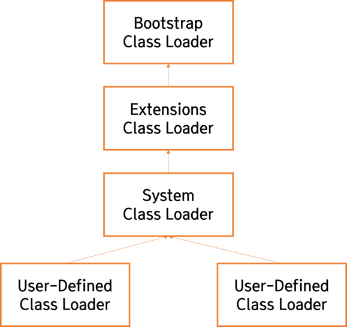
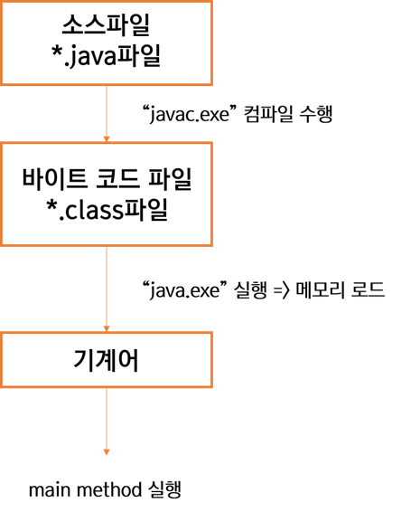

## CH01. 자바 시작하기

1. 자바의 특징

   - 이식성이 높은 언어이다.

     

   - 객체 지향 언어이다.

     

   - 함수적 스타일 코딩을 지원한다.

     > **함수적 프로그래밍**이란?
     >
     > *함수형 프로그램은 대입문이 없어 변수에 값이 할당되면 그 이후 값이 절대  변하지 않는다. 좀 더 일반적으로 말하자면, 함수형 프로그램은 부수 효과(side effect)가 전혀 없다.*
     >
     > "John Hughes의 Why Functional Programming Matters 中"

     - 자바에서는 람다식을 통해 함수적 프로그래밍을 지원한다

     

   - 메모리를 자동으로 관리한다.

     > **Garbage Collector** (가비지 컬렉터)
     >
     > Heap 영역의 object 중 stack에서 도달 불가능하다면 GC의 대상이 된다.
     >
     > Mark: 어떤 객체를 참조하고 있는지찾는 과정
     >
     > Sweep: mark 되어있지 않은 객체를 힙에서 제거하는 과정

     

   - 다양한 애플리케이션을 개발할 수 있다.

     

   - 멀티 스레드를 쉽게 구현할 수 있다.

     

   - 동적 로딩을 지원한다.

     > 클래스 로더 간 계층 구조

      

     - 로드 타임 동적로딩: Class를 읽어오는 과정에서 로드
     - 런타임 동적 로딩: Class.forName(args[0])에서 args[0]을 호출하는 순간

   - 막강한 오픈소스 라이브러리가 풍부하다.

2. JVM (Java Virtual Machine)

   *중간 단계의 바이트 코드를 해석하고 실행할 수 있는 가상의 운영체제라고 볼 수 있다*
   
   
